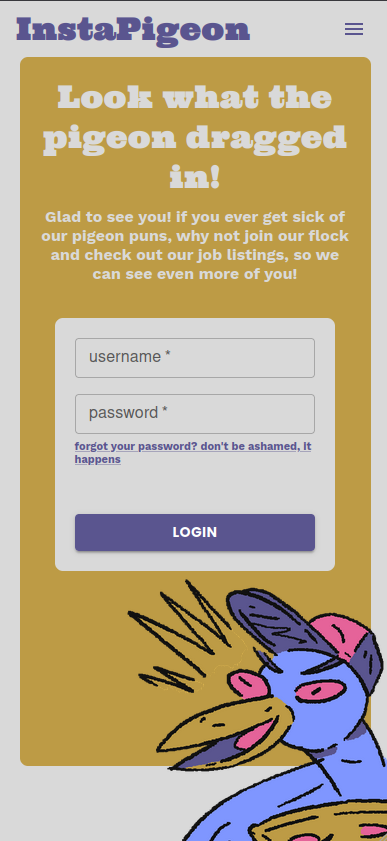
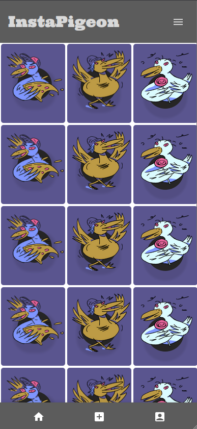

# InstaPigeon :

an instagram for pigeons

## description of the project :

-  a picture sharing platform for sharing pictures of pigeons you see in the street ;

## figma prototypes :

[desktop](./instap-desktop.pdf)
[mobile](./instap-phone.pdf)
[styleguide](./instap-styleguide.pdf)

to add :

// plus a slogan

// link for maguette

// live link

// ERD, diagram de la DB

## techs :

-  [front-end] : React, Typescript, Framer Motion, MUI;

-  [back-end] : nodeJs, Express.JS, JS web tokens;
